<!-- CUSTOM ANIMATED BANNER — hand-built SVG, boots up on every visit -->
<div align="center">
  
</div>

<!-- BADGES / SOCIALS -->
<div align="center">
  <a href="https://linkedin.com/in/deniz-arslan2022">
    
  </a>
  <a href="mailto:denizarsln2022@gmail.com">
    
  </a>
  
</div>

---

<!-- ABOUT ME — terminal style -->
```console
deniz@github:~$ whoami
> BSc Computer Science graduate — Durham University
> Happiest where code gets creative: AI × perception, sound × image, play × design

deniz@github:~$ ./status --now
> 🔭 In the lab: turning strange ideas into small, shippable experiments
> 🌱 Deepening: fundamentals, algorithms, and systems thinking
> 💬 Ask me about: my dissertation — subliminal imaging & crossmodal perception
> 🌍 Languages: English 🇬🇧 · Türkçe 🇹🇷
```

---

## ⚡ Tech Arsenal

<div align="center">
  
</div>

---

## 🧪 In The Lab

Things I'm building or plotting this season:

- 🎨 **Code you can feel** — coding emotional states as living visuals in p5.js (burnout as a fading particle system, and friends)
- 🎵 **Pictures that play music** — mapping images to chord progressions with Tonnetz geometry
- 👃 **Scents you can see** — spinning my dissertation research into a tool that turns spoken scent descriptions into procedurally generated abstract visuals

*Repos landing here as each one becomes real. Watch this space.*

---

## 🐍 Contribution Graph, But Alive

<div align="center">
  
</div>

---

<div align="center">
  <sub>💬 Always up for talking about creative tech, strange ideas, and how to build them.</sub>
</div>
